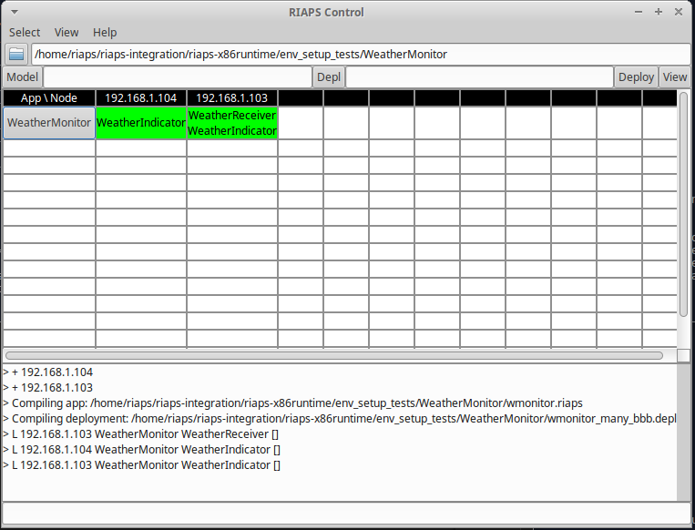
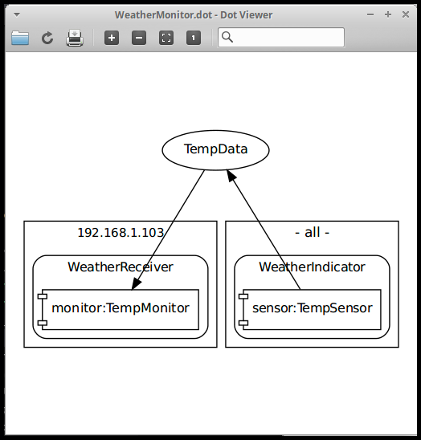

This a generic application to test that the development environment is setup and able to talk with the configured BBBs.  

## First Test VM with application on local node (VM)
1. Open 2 terminal windows and run the following command in the separate windows

   * ``` riaps_ctrl ```
   
   * ``` sudo -E riaps_deplo ```

2. With the 'riaps_ctrl' command, the RIAPS control GUI will come up.  The IP address of the host VM is added as a node.
    
   
    
3. In the control GUI, select the **WeatherMonitor** located under **~/env_setup_tests** folder.  Under the same folder select the **Model** file (.riaps) and deployment (**Depl**) file using the **wmonitor_vm_only.depl** file.  Then **Deploy** (button on the right) and click on the loaded WeatherMonitor application to **Launch** it.
    
4. When launching this application, the following is output on the RIAPS control GUI and from the different windows.
   
   
   
   ```
   riaps@riapsvboxmm:~/riaps_apps$ riaps_ctrl 
   5188:M 21 Aug 14:29:24.229 * Increased maximum number of open files to 10032 (it was originally set to 1024).
                   _._                                                  
              _.-``__ ''-._                                             
         _.-``    `.  `_.  ''-._           Redis 3.2.5 (00000000/0) 64 bit
     .-`` .-```.  ```\/    _.,_ ''-._                                   
    (    '      ,       .-`  | `,    )     Running in standalone mode
    |`-._`-...-` __...-.``-._|'` _.-'|     Port: 6379
    |    `-._   `._    /     _.-'    |     PID: 5188
     `-._    `-._  `-./  _.-'    _.-'                                   
    |`-._`-._    `-.__.-'    _.-'_.-'|                                  
    |    `-._`-._        _.-'_.-'    |           http://redis.io        
     `-._    `-._`-.__.-'_.-'    _.-'                                   
    |`-._`-._    `-.__.-'    _.-'_.-'|                                  
    |    `-._`-._        _.-'_.-'    |                                  
     `-._    `-._`-.__.-'_.-'    _.-'                                   
         `-._    `-.__.-'    _.-'                                       
             `-._        _.-'                                           
                 `-.__.-'                                               

   5188:M 21 Aug 14:29:24.230 # WARNING: The TCP backlog setting of 511 cannot be enforced because /proc/sys/net/core/somaxconn is set 
   to the lower value of 128.
   5188:M 21 Aug 14:29:24.230 # Server started, Redis version 3.2.5
   5188:M 21 Aug 14:29:24.230 # WARNING overcommit_memory is set to 0! Background save may fail under low memory condition. To fix this 
   issue add 'vm.overcommit_memory = 1' to /etc/sysctl.conf and then reboot or run the command 'sysctl vm.overcommit_memory=1' for this 
   to take effect.
   5188:M 21 Aug 14:29:24.230 # WARNING you have Transparent Huge Pages (THP) support enabled in your kernel. This will create latency 
   and memory usage issues with Redis. To fix this issue run the command 'echo never > /sys/kernel/mm/transparent_hugepage/enabled' as 
   root, and add it to your /etc/rc.local in order to retain the setting after a reboot. Redis must be restarted after THP is disabled.
   5188:M 21 Aug 14:29:24.230 * The server is now ready to accept connections on port 6379


   riaps@riapsvboxmm:~$ sudo -E riaps_deplo
   Ethernet link detected
   [2018-08-21 14:29:31.104] [rbeacon] [info] Starting RIAPS DISCOVERY SERVICE 
   [2018-08-21 14:29:31.110] [rdiscovery] [info] Starting DHT node on 192.168.1.104:4222 (080027fc58ea)
   [2018-08-21 14:29:31.112] [rbeacon] [info] DHT thread is initialized, starts beaconing.
   adduser: The user `weathermonitor58ea' already exists.
   INFO:14:30:21,986:[5293]:TempSensor:(PID 5293)-starting TempSensor, Tue Aug 21 14:30:21 2018
   INFO:14:30:21,986:[5293]:TempSensor:Initial temp:65, Tue Aug 21 14:30:21 2018
   [2018-08-21 14:30:21.988] [rdiscovery] [info] Register actor with PID - 5293 : /WeatherMonitor/WeatherIndicator/
   INFO:14:30:23,055:[5299]:TempMonitor:(PID 5299)-starting TempMonitor, Tue Aug 21 14:30:23 2018
   [2018-08-21 14:30:23.056] [rdiscovery] [info] Register actor with PID - 5299 : /WeatherMonitor/WeatherReceiver/
   [2018-08-21 14:30:24.245] [rdiscovery] [info] Register service: /WeatherMonitor/TempData/pub@192.168.1.104:38881
   [2018-08-21 14:30:24.748] [rdiscovery] [info] Lookup: /WeatherMonitor/TempData/pub
   [2018-08-21 14:30:25.157] [rdiscovery] [info] Search for registered actor: /WeatherMonitor/WeatherReceiver/
   [2018-08-21 14:30:25.157] [rdiscovery] [info] Update() returns tempupdate@192.168.1.104:38881 to /WeatherMonitor/WeatherReceiver/
   [2018-08-21 14:30:25.158] [rdiscovery] [info] Get() returns tempupdate@192.168.1.104:38881 to /WeatherMonitor/WeatherReceiver/
   INFO:14:30:29,778:[5293]:TempSensor:on_clock(): Temperature - 66, PID 5293, Tue Aug 21 14:30:29 2018
   INFO:14:30:29,784:[5299]:TempMonitor:on_tempupdate(): Temperature:66, PID Tue Aug 21 14:30:29 2018, Timestamp:Tue Aug 21 14:30:29 
   2018
   INFO:14:30:34,793:[5293]:TempSensor:on_clock(): Temperature - 67, PID 5293, Tue Aug 21 14:30:34 2018
   INFO:14:30:34,794:[5299]:TempMonitor:on_tempupdate(): Temperature:67, PID Tue Aug 21 14:30:34 2018, Timestamp:Tue Aug 21 14:30:34 
   2018
   ```

5.  Halt the application using the RIAPS control GUI.  Select the application button (WeatherMonitor) and choose **Halt**.  The application can also be restarted by selecting **Launch** again.

6.  When work with this application is complete, use the RIAPS control GUI to **Remove** the application.
       
## Second Test a Single BBB Talks with the VM
1.  SSH into the BBB, where xxxx refers to the hostname seen when logged into the BBB.  Or use the IP address instead (xxx.xxx.xxx.xxx).

    ```       
    ssh riaps@bbb-xxxx.local 
    
    ```
    
2.  On the VM, open a terminal windows and run the following command in the separate windows
   
    ``` riaps_ctrl ```
   
3.  The BBB will automatically run ``` riaps_deplo ``` as a service.

4.  With the 'riaps_ctrl' command, the RIAPS control GUI will come up.  The IP address of the BBB is added as a node.
        
5.  Edit the **~/env_setup_tests/WeatherMonitor/wmonitor_1_bbb.depl** file to point to the BBB using either the hostname or the IP address.

6.  In the control GUI, select the **WeatherMonitor** located under **~/env_setup_tests** folder using the **wmonitor_1_bbb.depl** file.

7.  When the application is launched, the same output as indicate in the VM only test will be available.

 
## Third Test that Multiple BBBs can Talk with the VM
1.  SSH into the BBBs, where xxxx refers to the hostname seen when logging into the BBBs.
  
    ``` ssh riaps@bbb-xxxx.local ```
    
2.  On the VM, open a terminal windows and run the following command
   
    ``` riaps_ctrl ```
   
3.  The BBB will automatically run ``` riaps_deplo ``` as a service.

4.  With the 'riaps_ctrl' command, the RIAPS control GUI will come up.  You should see the IP address of your BBBs added as different nodes.
        
5.  The **~/env_setup_tests/WeatherMonitor/wmonitor_manny_bbb.depl** file is setup to have a single BBB be the WeatherReceiver and then all BBBs will report a temperature number (WeatherIndicator).  Edit this file to point the WeatherReceiver to one of the BBBs using either the hostname or the IP address.

6.  In the control GUI, select the **WeatherMonitor** located under **~/env_setup_tests** folder using the **wmonitor_many_bbb.depl** file.

7.  When launching this application, the following outputs on the RIAPS control GUI and BBBs application information.

    
     
     * For BBB that is only a WeatherIndicator, which is at 192.168.1.104

    ```
    INFO:16:23:54,200:[7114]:TempSensor:(PID 7114)-starting TempSensor, Tue Aug 21 16:23:54 2018
    INFO:16:23:54,200:[7114]:TempSensor:Initial temp:65, Tue Aug 21 16:23:54 2018
    INFO:16:24:00,885:[7114]:TempSensor:on_clock(): Temperature - 66, PID 7114, Tue Aug 21 16:24:00 2018
    INFO:16:24:05,886:[7114]:TempSensor:on_clock(): Temperature - 67, PID 7114, Tue Aug 21 16:24:05 2018
    INFO:16:24:10,895:[7114]:TempSensor:on_clock(): Temperature - 68, PID 7114, Tue Aug 21 16:24:10 2018
    INFO:16:24:15,913:[7114]:TempSensor:on_clock(): Temperature - 69, PID 7114, Tue Aug 21 16:24:15 2018
    ```

    * For BBB that is both WeatherReceiver and WeatherIndicator, which is at 192.168.1.103
    
    ```
    Aug 21 21:24:00 bbb-d5b5 RIAPS-DEPLO[1759]: INFO:21:24:00,507:[1828]:TempSensor:(PID 1828)-starting TempSensor, Tue Aug 21 21:24:00 2018
    Aug 21 21:24:00 bbb-d5b5 RIAPS-DEPLO[1759]: INFO:21:24:00,518:[1828]:TempSensor:Initial temp:65, Tue Aug 21 21:24:00 2018
    Aug 21 21:24:03 bbb-d5b5 RIAPS-DEPLO[1759]: INFO:21:24:03,175:[1830]:TempMonitor:(PID 1830)-starting TempMonitor, Tue Aug 21 21:24:03 2018
    Aug 21 21:24:05 bbb-d5b5 RIAPS-DEPLO[1759]: INFO:21:24:05,888:[1830]:TempMonitor:on_tempupdate(): Temperature:67, PID Tue Aug 21 21:24:05 2018, Timestamp:Tue Aug 21 16:24:05 2018
    Aug 21 21:24:06 bbb-d5b5 RIAPS-DEPLO[1759]: INFO:21:24:06,482:[1828]:TempSensor:on_clock(): Temperature - 66, PID 1828, Tue Aug 21 21:24:06 2018
    Aug 21 21:24:06 bbb-d5b5 RIAPS-DEPLO[1759]: INFO:21:24:06,489:[1830]:TempMonitor:on_tempupdate(): Temperature:66, PID Tue Aug 21 21:24:06 2018, Timestamp:Tue Aug 21 21:24:06 2018
    Aug 21 21:24:10 bbb-d5b5 RIAPS-DEPLO[1759]: INFO:21:24:10,897:[1830]:TempMonitor:on_tempupdate(): Temperature:68, PID Tue Aug 21 21:24:10 2018, Timestamp:Tue Aug 21 16:24:10 2018
    Aug 21 21:24:11 bbb-d5b5 RIAPS-DEPLO[1759]: INFO:21:24:11,483:[1828]:TempSensor:on_clock(): Temperature - 67, PID 1828, Tue Aug 21 21:24:11 2018
    Aug 21 21:24:11 bbb-d5b5 RIAPS-DEPLO[1759]: INFO:21:24:11,490:[1830]:TempMonitor:on_tempupdate(): Temperature:67, PID Tue Aug 21 21:24:11 2018, Timestamp:Tue Aug 21 21:24:11 2018
    Aug 21 21:24:15 bbb-d5b5 RIAPS-DEPLO[1759]: INFO:21:24:15,915:[1830]:TempMonitor:on_tempupdate(): Temperature:69, PID Tue Aug 21 21:24:15 2018, Timestamp:Tue Aug 21 16:24:15 2018
    Aug 21 21:24:16 bbb-d5b5 RIAPS-DEPLO[1759]: INFO:21:24:16,484:[1828]:TempSensor:on_clock(): Temperature - 68, PID 1828, Tue Aug 21 21:24:16 2018
    Aug 21 21:24:16 bbb-d5b5 RIAPS-DEPLO[1759]: INFO:21:24:16,490:[1830]:TempMonitor:on_tempupdate(): Temperature:68, PID Tue Aug 21 21:24:16 2018, Timestamp:Tue Aug 21 21:24:16 2018
    Aug 21 21:24:20 bbb-d5b5 RIAPS-DEPLO[1759]: INFO:21:24:20,918:[1830]:TempMonitor:on_tempupdate(): Temperature:70, PID Tue Aug 21 21:24:20 2018, Timestamp:Tue Aug 21 16:24:20 2018
    Aug 21 21:24:21 bbb-d5b5 RIAPS-DEPLO[1759]: INFO:21:24:21,485:[1828]:TempSensor:on_clock(): Temperature - 69, PID 1828, Tue Aug 21 21:24:21 2018
    Aug 21 21:24:21 bbb-d5b5 RIAPS-DEPLO[1759]: INFO:21:24:21,491:[1830]:TempMonitor:on_tempupdate(): Temperature:69, PID Tue Aug 21 21:24:21 2018, Timestamp:Tue Aug 21 21:24:21 2018
    ```
   
   ## Viewing the Application Model

   To understand an application and how the model ports are connected, use the **View** button on the far right of the RIAPS Control GUI.  For the WeatherMonitor application, the model view will look as follows:

   
